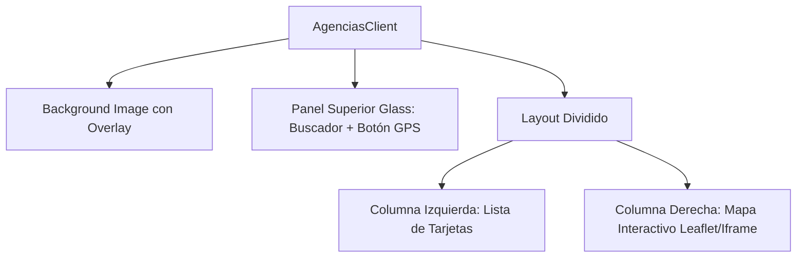

# Módulo de Agencias y Geolocalización (Store Locator)

Este documento detalla la arquitectura del buscador de agencias. Está vinculado con [[01_Arquitectura]].

## Arquitectura Visual (UI/UX)
El componente `AgenciasClient.tsx` unifica el Hero, los filtros y el mapa en una sola vista de "Dashboard Glassmorphism".

## Lógica de Geolocalización
Cuando el usuario presiona "Encontrar más cercana":
1. Se invoca `navigator.geolocation.getCurrentPosition`.
2. Se calcula la distancia mediante la **Fórmula de Haversine**.
3. Se ordena la lista para colocar la agencia más cercana en primer lugar.
4. En móvil, se hace scroll automático al mapa.
